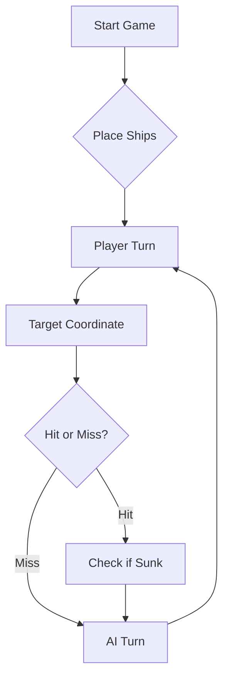

# Resposta à questão do LAB
### 2.(...)  Como é que o Maven descobre quais são as dependências transitivas? Quando compilar o programa pela primeira vez, são todas descarregadas para o repositório local, sendo as próximas compilações mais rápidas. Porquê?

O Maven fica a conhecer as dependências transitivas através do ficheiro pom.xml que contém informação das bibliotecas declaradas no projeto. Cada biblioteca possui um POM que especifica as suas próprias dependências, permitindo ao Maven descarregar automaticamente todas as bibliotecas necessárias.
Na primeira compilação, todas as dependências são descarregadas para o repositório local Maven. Nas compilações seguintes, essas dependências já estão armazenadas localmente, pelo que não precisam de ser descarregadas novamente, tornando o processo de compilação mais rápido.


## Estratégia de geração de rajadas de tiros

A estratégia de geração de rajadas de tiros foi concebida para maximizar a eficiência dos disparos, reduzindo tentativas desperdiçadas e tirando partido da informação acumulada ao longo da partida. Para isso, o comportamento do jogador automático segue as regras descritas abaixo.

### 1. Manutenção de um Diário de Bordo

Cada rajada disparada é registada num **Diário de Bordo**, sendo numerada sequencialmente (**Rajada 1, Rajada 2, Rajada 3, ...**).  
Para cada tiro efetuado, são armazenados:
- a coordenada exata do disparo;
- o resultado obtido, como por exemplo:
  - Água
  - Navio atingido
  - Navio afundado

Este registo histórico permite utilizar a informação recolhida em jogadas anteriores para melhorar a tomada de decisão nas jogadas seguintes.

### 2. Evitar tiros inválidos ou repetidos

A estratégia nunca deve disparar:
- fora dos limites do mapa;
- em coordenadas já anteriormente testadas.

A única exceção ocorre na última rajada do jogo, caso seja necessário completar os **3 tiros obrigatórios**, mesmo quando a frota inimiga já se encontra totalmente destruída.

### 3. Exploração de posições contíguas após um acerto

Quando um tiro atinge um navio, a jogada seguinte deve privilegiar as posições contíguas ao impacto:
- Norte
- Sul
- Este
- Oeste

O objetivo é descobrir rapidamente a orientação da embarcação e aumentar a probabilidade de a afundar nas jogadas seguintes.

No entanto, se a rajada anterior já tiver confirmado que o navio foi afundado, esta exploração não deve continuar, uma vez que os navios nunca podem estar encostados entre si.

### 4. Aproveitamento da orientação linear dos navios

As embarcações **Caravela**, **Nau** e **Fragata** ocupam posições em linha reta. Assim, um tiro certeiro indica que o restante corpo do navio se encontra alinhado na horizontal ou na vertical.

Além disso, como os navios não se podem tocar, nem sequer nas diagonais, as posições diagonais relativamente a um tiro certeiro podem ser consideradas **água garantida**.

A única exceção é o **Galeão**, cuja forma em **T** impede esta simplificação em todos os casos.

### 5. Marcação do halo de segurança após afundamento

Quando uma rajada confirma que um navio foi afundado, deve ser feita uma análise ao Diário de Bordo para identificar exatamente todas as posições ocupadas por essa embarcação.

Depois de determinada a localização completa do navio, todas as quadrículas adjacentes ao seu redor devem ser marcadas como **água intransitável**, formando um halo de segurança.

Isto é válido porque, pelas regras do jogo, não pode existir qualquer outra embarcação nesse perímetro.

### 6. Resolução do jogo

Se a frota própria for totalmente destruída, o jogador deve declarar a derrota.

Se, pelo contrário, for a frota inimiga a ficar totalmente afundada, o jogador deve assinalar a vitória.


# ⚓ Battleship 2.0


> A modern take on the classic naval warfare game, designed for the XVII century setting with updated software engineering patterns.

---

## 📖 Table of Contents
- [Project Overview](#-project-overview)
- [Key Features](#-key-features)
- [Technical Stack](#-technical-stack)
- [Installation & Setup](#-installation--setup)
- [Code Architecture](#-code-architecture)
- [Roadmap](#-roadmap)
- [Contributing](#-contributing)

---

## 🎯 Project Overview
This project serves as a template and reference for students learning **Object-Oriented Programming (OOP)** and **Software Quality**. It simulates a battleship environment where players must strategically place ships and sink the enemy fleet.

### 🎮 The Rules
The game is played on a grid (typically 10x10). The coordinate system is defined as:

$$(x, y) \in \{0, \dots, 9\} \times \{0, \dots, 9\}$$

Hits are calculated based on the intersection of the shot vector and the ship's bounding box.

---

## ✨ Key Features
| Feature | Description | Status |
| :--- | :--- | :---: |
| **Grid System** | Flexible $N \times N$ board generation. | ✅ |
| **Ship Varieties** | Galleons, Frigates, and Brigantines (XVII Century theme). | ✅ |
| **AI Opponent** | Heuristic-based targeting system. | 🚧 |
| **Network Play** | Socket-based multiplayer. | ❌ |

---

## 🛠 Technical Stack
* **Language:** Java 17
* **Build Tool:** Maven / Gradle
* **Testing:** JUnit 5
* **Logging:** Log4j2

---

## 🚀 Installation & Setup

### Prerequisites
* JDK 17 or higher
* Git

### Step-by-Step
1. **Clone the repository:**
   ```bash
   git clone [https://github.com/britoeabreu/Battleship2.git](https://github.com/britoeabreu/Battleship2.git)
   ```
2. **Navigate to directory:**
   ```bash
   cd Battleship2
   ```
3. **Compile and Run:**
   ```bash
   javac Main.java && java Main
   ```

---

## 📚 Documentation

You can access the generated Javadoc here:

👉 [Battleship2 API Documentation](https://britoeabreu.github.io/Battleship2/)


### Core Logic
```java
public class Ship {
    private String name;
    private int size;
    private boolean isSunk;

    // TODO: Implement damage logic
    public void hit() {
        // Implementation here
    }
}
```

### Design Patterns Used:
- **Strategy Pattern:** For different AI difficulty levels.
- **Observer Pattern:** To update the UI when a ship is hit.
</details>

### Logic Flow


---

## 🗺 Roadmap
- [x] Basic grid implementation
- [x] Ship placement validation
- [ ] Add sound effects (SFX)
- [ ] Implement "Fog of War" mechanic
- [ ] **Multiplayer Integration** (High Priority)

---

## 🧪 Testing
We use high-coverage unit testing to ensure game stability. Run tests using:
```bash
mvn test
```

> [!TIP]
> Use the `-Dtest=ClassName` flag to run specific test suites during development.

---

## 🤝 Contributing
Contributions are what make the open-source community such an amazing place to learn, inspire, and create.

1. Fork the Project
2. Create your Feature Branch (`git checkout -b feature/AmazingFeature`)
3. Commit your Changes (`git commit -m 'Add some AmazingFeature'`)
4. Push to the Branch (`git push origin feature/AmazingFeature`)
5. Open a **Pull Request**

---

## 📄 License
Distributed under the MIT License. See `LICENSE` for more information.

---
**Maintained by:** [@britoeabreu](https://github.com/britoeabreu)  
*Created for the Software Engineering students at ISCTE-IUL.*
